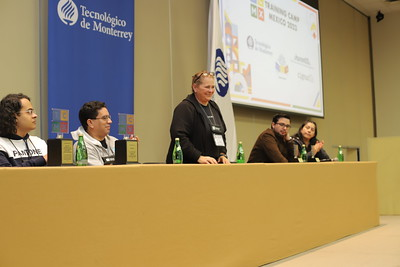
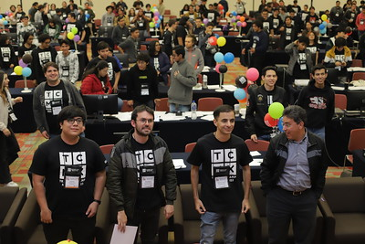
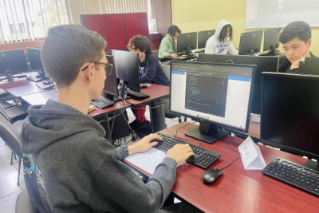
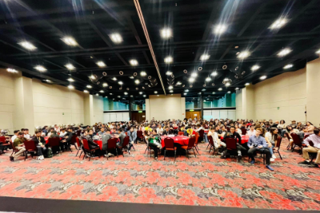

# Where is huronOS being used?

huronOS is currently being used at many competitive programming communities! We don't keep track of all them as huronOS does not uses telemetry, but we work closely with several organizations.

Some of the highlights are:

### **[Training Camp Mexico](https://tcmx.icpcmexico.org)**
The TCMX is the *official* training camp for the ICPC Mexico region in which huronOS is in charge of building the contest arena. This is a yearly training camp which brings the LATAM Champions of the ICPC World Finals to train multiple teams that are looking for their first regional finals.

### **[Mexican Olympiad of Informatics](https://www.olimpiadadeinformatica.org.mx)**
huronOS is the official operating system for the Mexican Olympiad of Informatics, which is the last competition before the Mexican delegation is selected to represent Mexico in the **[International Olympiads of Informatics](https://ioinformatics.org)**. 
The team closely tracks and keep the system up to date to the OMI requirements.

### ICPC "Gran Premio de México"
"El Gran Premio de México" it's the qualification rounds for competing in the ICPC Mexico Regional Finals. This a multi-location synchronized contest, in which many universities host the ICPC competition, with many of them using huronOS to host their competitions. Some universities using huronOS are: 
- Escuela Superior de Cómputo del Instituto Politécnico Nacional (ESCOM-IPN)
- Escuela Superior de Física y Matemáticas del Instituto Politénico Nacional (ESFM-IPN)
- Facultad de Ingeniería de la Universidad Nacional Autónoma de México (FU-UNAM)
- Facultad de Estudios Superiores Acatlán de la Universidad Nacional Autónoma de México (FESA-UNAM)
- Centro de Nanociencias y Nanotecnologias Baja Califonia Sur de la Universdad Nacional Autónoma de México
- Tecnológico de Monterrey campus Monterrey (ITESM-MTY)
- Tecnológico de Monterrey campus Guadalajara (ITESM-GDL)
- Tecnológico de Monterrey campus Puebla (ITESM-PUE)
- Universidad Autonoma de Nuevo Leon (UANL)
- Universidad Nacional de Colombia (UNAL)

