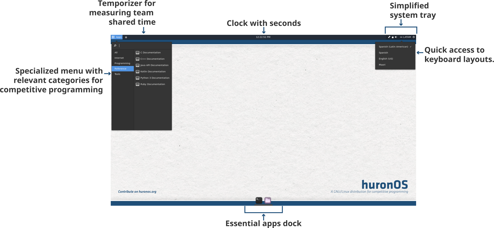

# Introduction to huronOS
**huronOS** is GNU / Linux distribution that is **specialized in competitive programming** and all the activities around it, like official contests, training camps, practice contests or tests.

## What is different with huronOS?
huronOS is designed to work as a **live USB** compatible with both legacy and UEFI BIOS so that you **don't need to modify the hardware** provided by your educational institution, you only boot and **in a matter of seconds** you can have a **competitive programming environment** ready for a competition.

## Desktop Environment

The huronOS desktop environment is **unique of it's kind**, being designed to only **keep what it's important** for the contestants: Coding, Collaborating, No Distractions.

## Synchronization 
We know that most of competitive programming activities are not individual but with a **group of people** that will compete together at the same location or on the same arena. That's why huronOS is built with **synchronization in mind**. huronOS is capable of sync with network-directives that set the **behavior** of the system, like the **software** to enabled for the contestants, the **firewall** setup, the **wallpapers**, the **auto mounting** rules for external devices, the **timezone**, the **keyboard layouts**, etc. Everything **remotely controlled** and applied to all the instances configured with that directives.

## Execution modes
huronOS have an ***execution mode*** feature that enables you to arrange **multiple contest** at different moments and limit them by time and date, so that once a contest mode starts, huronOS knows that all the **filesystem** needs to be **clean** and ready for an **isolated environment** for the competition. This way you don't need to clean the devices for every contest.

## Double persistence
huronOS have a **persistence** module for **each** execution mode, like an **event** such as a training camps and the **contests** that can live inside a training camp. This way you can have a persistent drive for all the code during the learning, but as soon as the contest starts, the event data will be **unaccessible** to the contestant. After the contests finishes, the code of the contest can be copied to the event drive, ready for **upsolving** and continue the learning while accumulating all the previous changes. 

## Quick Setups
All these features, enables **site managers** to **quickly change** the setup of their huronOS instances to arrange an **IOI-like** contest with certain software requirements for today, and then an **ICPC-like** contest for tomorrow without needing to worry about preparing everything in time.