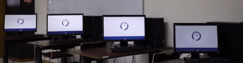
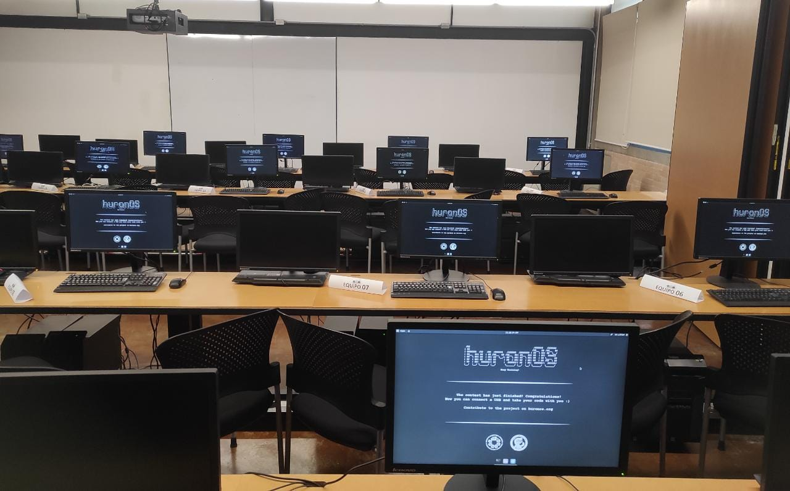
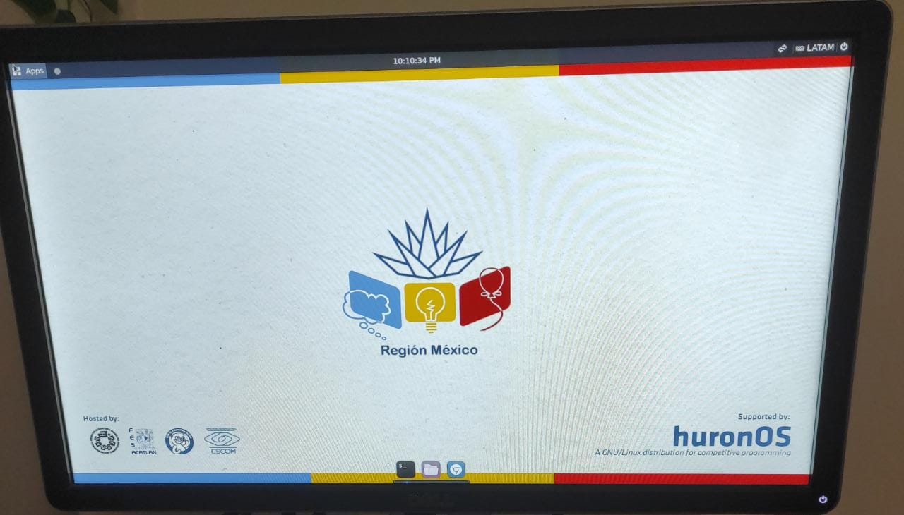

# Using for contest
Installing huronOS is a once in a while task that might take you some time at the begin, but as soon as you've finished the installations, setting up a single contest is a really easy task. 

## What can I do with huronOS for setting up a contest?
- You can setup up to **N instances** of huronOS and keep them in sync. It doesn't matter if your contest is for **3 contestants** or **230 contestants** they all will be in **sync** as long as they have network connectivity to download their behavior directives.

- In **difference** with a **traditional OS** installation, you **don't need to prepare** the huronOS instances long before the contests, or needing to do a configuration on each of the computers with huronOS booted. What you'll be doing to to **update the contest times** in your behavior directives, and **all the instances will schedule a *contest mode*** start at the time you step. With this, all the instances will clean the filesystem and apply your rules like the firewall or the wallpaper.

- You can **disable the USB drives** automount to ensure that contestants cannot connect any drive to copy any file into the system. **After a contest** finishes you can **enable the USB drives** automount and let the contestants copy their code, ready for the **upsolving** time.

- You can **setup the firewall remotely**, it doesn't matter if you'll be participating on ***Codeforces*, *A2OJ*, *Kattis*** or any other judge, you can remotely setup this exceptions and **keep the rest of the internet unaccessible**. We do even have some well-known setups that you can find on our [Common Firewall Settings](/docs/category/common-firewall-settings) docs.

- You can **easily change the wallpapers** for the system, even during a running contest! Setting up last minute changes of the branding for your contest is easy peasy.

- You can setup **browser bookmarks** remotely for having direct access to you contest rules PDF, the printing service, or the judge url, etc. No more `https://jewdejkn.kjdknd.kejf.someschool.edu/contest/36et3873873/arena` are needed to be typed manually by all contestants.

- You can **arrange daily contests**, weekend contests, warmups or **whichever frequency** you want. You **don't need to reinstall huronOS** unless you want to update to a newer version.  
    *And hopefully will be releasing a system update tool to avoid this.*

## How do I setup my own contest?

1. In the highly likely scenario that you'll be using huronOS for multiple teams/contestants contest, we do recommend you **buying USB** drives that are from a **well-known storage media company** such as *SanDisk*, *Kingstone* or *Samsung* (etc). We highly discourage you to buy cheap USB drives that doesn't have any mark and are commonly used with tampography.  
    We might open a store in the near future to buy the USB drives already prepared for you, ready to just plug and use. But we'll be needing to do some work around that store. 

2. Setup your directives file by following the [Creating a Directives File](../usage/directives/creating-a-directives-file.md) docs.

3. To install huronOS we recommend you following the [**installation guide**](../usage/how-to-install.md), make sure to test each USB booting.

4. Test the USB drives in the labs were you'll be holding the contest, make sure to check the models of the PCs, know which key to press for booting on USB drives, ask your IT admins if you need to allow the USB drives boot. We do recommend you having at least **8GiB** of RAM on the computer running huronOS, remember that the systems lives on the RAM. 

5. Test the system by changing directives, setting a mock contest, testing the configurations propagation, the access to the directives file. Make sure that the server with the directives file, the wallpapers and the firewall exceptions like the online judge are not blocked by WAN/LAN level firewall.

6. Arrange a test contest. It's better to always test the system before your first real time use, this way you can familiarize more with it and how to manage it.

7. Run the contest! Cool, now you're ready to run a contest, and you don't need to repeat the steps before unless you're changing the hardware/arena you'll be using. Nos just setup all of you following contests by modifying your directives file, and booting!

## How do a contest looks like with huronOS?

#### 4 huronOS instances changing from a *default* mode to the *contest mode*.

#### Laboratory just before a contest arranged at UNAM.

#### Custom wallpaper being prepared for ICPC MX qualification round.
