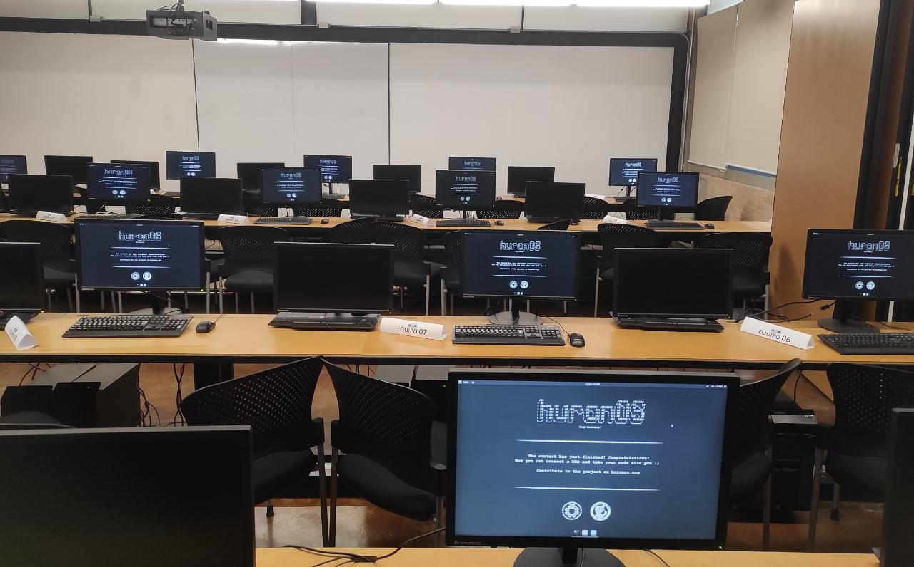
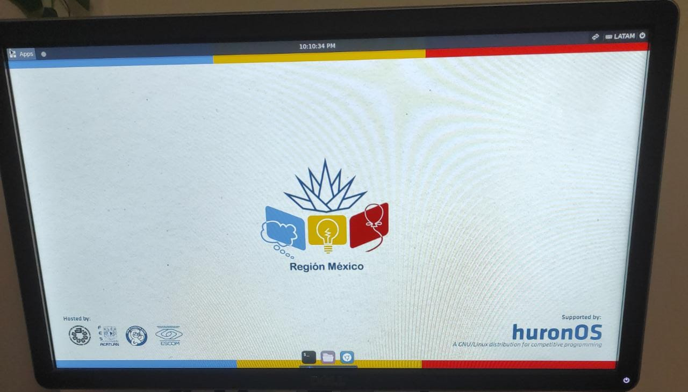

# Using for contest
Installing huronOS is a once in a while task that might take you some time at the beginning, but as soon as you've finished the installations, setting up a single contest is a really easy task. 

## What can I do with huronOS to set up a contest?
- You can set up up to **N instances** of huronOS and keep them in sync. It doesn't matter if your contest is for **3 contestants** or **230 contestants** they will all be in **sync** as long as they have the proper network connectivity to download their behavior directives.

- In **contrast** to a **traditional OS** installation, you **don't need to prepare** the huronOS instances long before the contests, neither do you need to perform an individual configuration on each of the computers with huronOS booted. What you'll be doing instead, would be to **update the contest times** in your behavior directives, and **all the instances would schedule a *contest mode*** starting at the time you determine. With this, all the instances will clean the filesystem and apply your rules, like the firewall or the wallpaper.

- You can **disable the USB drives'** automount to ensure that contestants cannot connect any other drive to copy any file into the system. **After a contest** finishes, you can **enable the USB drives'** automount and let the contestants copy their code, ready for the **upsolving** time.

- You can **remotely setup the firewall**. It doesn't matter if you'll be participating in ***Codeforces*, *A2OJ*, *Kattis*** or any other judge, you can remotely setup this exceptions and **keep the rest of the internet inaccessible**. We even have some well-known setups that you can find on our [Common Firewall Settings](/docs/category/common-firewall-settings) docs.

- You can **easily change the wallpapers** for the system, even during a running contest! Setting up last minute changes for the branding of your contest is pretty straightforward.

- You can remotely setup **browser bookmarks** to allow direct access to your contest rules' PDF, the printing service, or the judge url, etc. No `https://jewdejkn.kjdknd.kejf.someschool.edu/contest/36et3873873/arena` are required to be typed manually by each contestant.

- You can **arrange daily contests**, weekend contests, warmups or **whatever frequency** you want. You **don't need to reinstall huronOS** unless you want to update it to a newer version.  
    *And hopefully we'll be releasing a system update tool to prevent this.*

## How do I setup my own contest?

1. In the highly likely scenario in which you'll be using huronOS for 'multiple teams/contestants' type contest, we recommend you **buy USB** drives from a **well-known storage media company** such as *SanDisk*, *Kingstone* or *Samsung* (etc). We highly discourage the purchase of cheap USB drives that don't have any branding and are commonly used with tampography.  
    *We might be openning a store in the near future where you'd be able to buy the USB drives ready to just plug in and use. But there's still work to be done in that regard.*

2. Setup your directives file by reading the [introduction to the directives file](../usage/directives/introduction-to-directives.md) docs.

3. To install huronOS we suggest you follow the [**installation guide**](../usage/how-to-install.md), make sure to test each USB booting process.

4. Test the USB drives in the labs were you'll be holding the contest, make sure to check the PCs' models to know which key to press for booting the system on the USB drives. Ask your IT admins if you need permissions for the USB drives to boot. We recommend you having at least **8GiB** of RAM on the computer running huronOS, remember that the system lives in the RAM. 

5. Test the system by changing directives, setting a mock contest, testing the configurations propagation, and the access to the directives file. Make sure that the server with the directives file, the wallpapers and the firewall exceptions, like the online judge, is not blocked by WAN/LAN level firewall.

6. Arrange a test contest. It's better to always test the system before your first real time use, this way you can familiarize more with it and how to manage it.

7. Run the contest! Cool, now you're ready to run a contest, and you don't need to repeat the steps before unless you're changing the hardware/arena you'll be using. Now, just setup all of you following contests by modifying your directives file, and boot them up!

## How do a contest looks like with huronOS?

#### 4 huronOS instances changing from a *default* mode to the *contest mode*.

#### Laboratory just before a contest organized at UNAM.

#### Custom wallpaper being prepared for ICPC MX qualification round.
