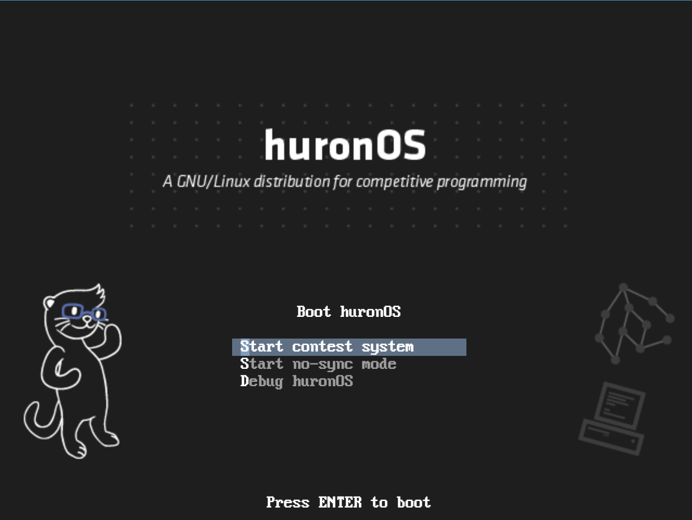

# Boot Options



## Start contest system
This is the default boot option, and you will boot into it after 7 seconds if you don't press `esc` before this timer ends.
This option by defaults sync to the **directives URL** that you setup during installation, this means that you'll have persistence enabled and all the directives you just setup on the directives file.

With this option, you only need to boot and all the configurations will be prepared for you! :D
 > Note, if for some reason during a contest you need to restart the computer of a contestant, please make use to still use this same option for boot and give the system 1 minute for recovery time and fully resync. Al the data of the contest should be automatically restored.

 ## Start no-sync mode
This option will boot huronOS with the *sync manager* deactivated, meaning that you won't have persistence, and no directive will be activated on the system. This option use useful for different scenarios like:
- Manually cleaning the `event/` or `contest/` partitions.
- Setting up a demo where you need to store data resilient to mode changes, e.g. casting screen to a projector.
- Developing huronOS and needing to use `savechanges` scripts.

If after booting on no-synd mode you want to start the contest system, please execute in a **root** shell:
```bash
systemctl start hsync.timer
```