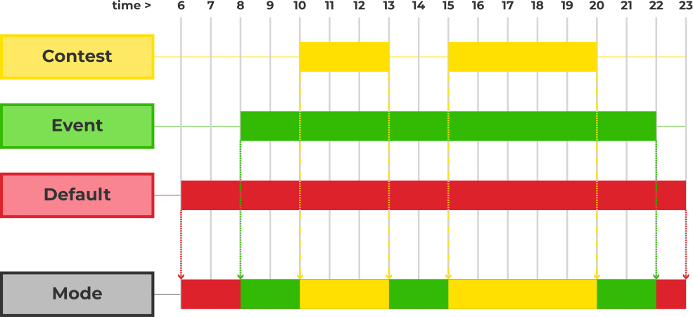

# Introduction to Directives

The *directives* consist of a collection of **preferences, configurations, and behaviors** that govern how the system operates. These directives have been specifically designed for *competitive programming*, facilitating the organization of competitions, training camps, and courses.

Currently, the directives are represented in the form of a *directives file*, a plain text file with a syntax resembling an *INI config file*, but adapted to suit our specific requirements.
> **Note:** huronOS is currently in its *alpha* stage, which is why the directives is in text file form; this provides the most optimal way to distribute the rules across the systems, even though they may lack robust security layers. In future versions, we plan to implement an API with a manager dashboard to control these rules more effectively and less knowledge required by the contest managers.

## Understanding the System Modes

One of the key features of huronOS is its *modalities*, enabling contest administrators to exert better control over huronOS usage during contests, training camps, warmups, and testing scenarios by providing distinct sets of *directives* and *persistence* depending on the current mode of operation. Therefore, the system can switch between modes based on *time*. We strongly recommend double-checking NTP protocol access in your network to ensure smooth mode transitions.

The system modes are deeply linked to huronOS' unique *filesystem*, providing separate persistence disks for event and default modes, as well as a contest mode (you can find more details in the internals' docs: [execution modes](../../internals/execution-modes.md), [system layers](../../internals/system-layers.md), [multi-layered persistence](../../internals/multi-layered-persistence.md)). Consequently, the directives file revolves around this flagship feature.

## Modes
The system offers three modes:
- **Default Mode**  
    This mode is always executed by default and does not consider the current time. It acts as the fallback mode if no other time-window mode with higher priority is set and the system's time is synchronized with NTP.

- **Contest Mode**  
    Contest mode must be scheduled using a time window specifying the start and end time of the contest. This ensures that each contest begins with a fresh persistent disk. Consequently, multiple contests can be arranged (e.g., setting a warmup before a contest), with each having a clean filesystem at the start. Thus, cleaning the system between contests becomes easier, removing the need to do it manually after each contest.

    After a contest ends, all contest data is packed into a directory with the format `contest-YYYYMMDDTHH-MM-SS`, reflecting the time of the contest's end. This directory is placed at the root of the filesystem, typically found at `/home/contestant/`.

    - Switching to *default* mode cleans the default persistence and leaves only the contest package in the home directory.
    - Switching to *event* mode preserves the event persistence and copies the contest packed directory to the home directory, allowing for accumulated contests data.

    > To learn more about setting times, refer to the [events and contests directives doc](./configurations/events-and-contests.md).

- **Event Mode**  
Event mode is specifically designed for situations such as *warmup contests* or *training camps*, where the system will host multiple contests, and data between the *contests* and *out-of-the-contests* times should not be accessible to the users.

Consider this example of a typical timetable for a training camp:

|   | Mon | Tue | Wed | Thu | Fri | 
| - | --- | --- | --- | --- | --- |
| 8am - 9am  | Breakfast |  Breakfast  |  Breakfast  |  Breakfast  |  Breakfast  | 
| 9am - 12pm | Class:   Graph Theory |  Class:   Dynamic Programming  |  Class:   Strings  |  Class:   Maths  |  Class:   Geometry  | 
| 1pm - 6pm  | Contest:   Graphs |  Contest:   DP  |  Contest:   Strings  |  Contest:   Maths  |  Contest:   Geometry  | 
| 7pm - 9pm  | Machine Time   Upsolving  |  Machine Time   Upsolving  |  Machine Time   Upsolving  |  Machine Time   Upsolving  |  Machine Time   Upsolving  | 

In event mode, the system has a separate partition disk (persistent) that stores all user data in parallel with the *contest* partition disk that holds the contest data. When switching to and from contest mode, the *event* data remains untouched, ensuring that data remains inaccessible to users during contests. This enables a dynamic similar to this:

| Time       | Mode    | Dynamic  |
| ---------- | ------- | -------- |
| 9am - 12pm | Event   | Users can use the computer to program during the class, implement learned algorithms, and apply them. Everyone has the same tooling and rules, allowing the teacher to request the use of specific tooling or contestants to try different editors or IDEs to better suit their needs outside contest times. |
| 1pm - 6pm  | Contest | huronOS enters contest mode: all event mode software is closed, the screen goes black, and the event filesystem is disconnected. A clean filesystem is connected to the system, and the GUI is restarted. All configurations are set to default state, and internet access is restricted to the Online Judge. Contestants are in equal conditions and can access the contest judge through their browser bookmark. |
| 7pm - 9pm  | Event   | After the contest finishes, the system closes all contest software and packages all the files in a directory. The event data is restored, and the contest data is already in the home directory, making all previous contests available. Users can solve unsolved problems during machine time and submit solutions. They can also connect a USB drive to copy their code to their own machine. |

## Mode Priorities

To better understand modes and mode transitions, we use the following diagram to illustrate how *mode priorities* (Contest > Event > Default) are utilized to set up contests and events:

In this example, you can see that the *default* mode is replaced with an event. This means that all data on the *default* persistence will be cleaned upon changing to the *event* mode, ensuring the event starts with a clean filesystem. Throughout the event, all data remains persistent between contests. The two contests are held within the contest time, and all contest data is copied to the event partition once the contest concludes. After the event, the filesystem is cleaned, and the *default* mode becomes active. Creating another event simply involves setting a new time window.
